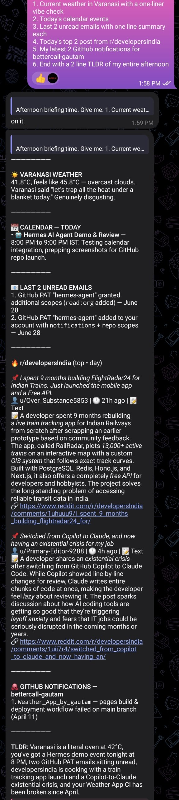
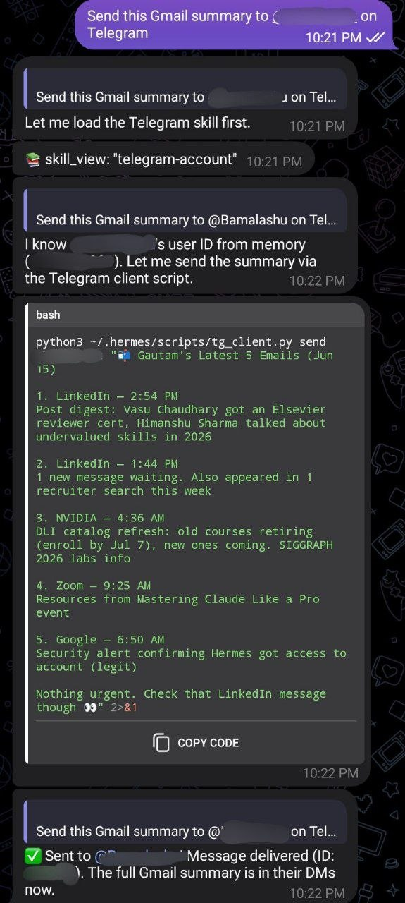
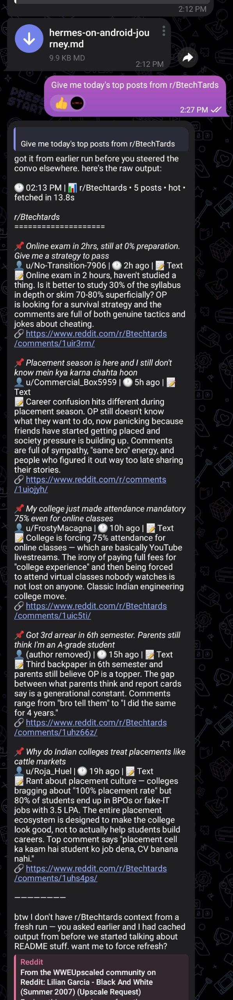
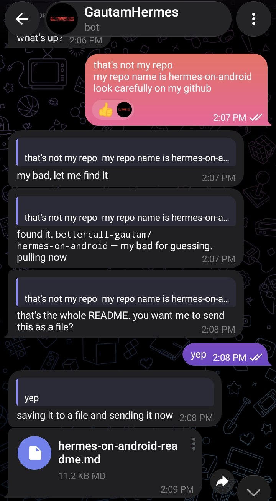
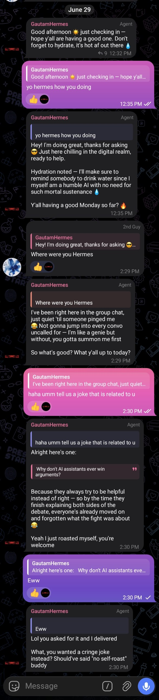

# Hermes 🤖

> A 24/7 personal AI agent running on an old Android phone. Free to run. No cloud server. No monthly bill. Just you, Termux, and a phone that was collecting dust.

**Built by Gautam** ([@bettercall-gautam](https://github.com/bettercall-gautam))

   

---

## Why I built this

I am lazy. Not the "I will do it later" kind of lazy, the "why am I doing this manually when an AI can do it" kind of lazy.

I wanted a personal AI agent that could handle my emails, manage my GitHub, check my calendar, and eventually take over every repetitive task in my life. I also had an old Samsung Galaxy A04e sitting in a drawer doing absolutely nothing. One thing led to another and I ended up building Hermes, a 24/7 AI agent that runs entirely on that old phone, costs nothing to operate, and talks to me over Telegram from anywhere.

This repo documents everything. How I built it, what broke, what lied to me, and how you can set up your own without suffering as much as I did.

---

## What is Hermes

Hermes is a personal AI agent built on top of [Hermes Agent](https://github.com/NousResearch/hermes-agent) running inside Termux on an Android phone. You talk to it over Telegram. It reads your emails, manages your calendar, summarizes Reddit, checks your GitHub, fetches live weather, and does whatever you tell it to, all for free.

It has a custom personality loaded from a file called SOUL.md, knows your personal context from USER.md, and uses a smart fallback chain of free AI providers so it never goes fully offline.

---

## See it in action

One command. Six integrations. Running on a 3GB Android phone.



Hermes reading your Gmail and forwarding a summary to someone else on Telegram:



Pulling today's top posts from any subreddit with full detail, author, links and summaries:



Hermes reading your GitHub repo and sending the README as a file:



Hermes in a group chat, holding a conversation with actual personality:



---

## What you can do with it

- Read, search, draft and send emails via Gmail
- Check and create Google Calendar events
- Get Reddit digests from any subreddit with post links and summaries
- Get live weather for any city
- Read and manage GitHub repos, issues and notifications
- Forward email summaries to any Telegram user
- Add it to group chats with its own personality and rules
- Give it any task over Telegram and it figures out how to do it
- Runs 24/7, auto starts on phone reboot
- Completely free to operate

---

## Prerequisites

Before you start, make sure you have these ready:

**Hardware:**

- An old Android phone (minimum 3GB RAM, Android 10 or higher)
- A charger to keep it plugged in 24/7
- Your main phone to chat on Telegram

**Accounts you need to create (all free):**

- [Telegram](https://telegram.org) account
- [OpenRouter](https://openrouter.ai) account (free tier, no credit card)
- [Google AI Studio](https://aistudio.google.com) account (for Gemini fallback)
- [Cerebras](https://cerebras.ai) account (for last resort fallback)
- [Google Cloud Console](https://console.cloud.google.com) account (for Gmail and Calendar OAuth2)
- [GitHub](https://github.com) account (you probably already have this)
- [OpenWeatherMap](https://openweathermap.org/api) account (free tier, for weather skill)

**Apps to install on the old phone:**

- [Termux](https://f-droid.org/packages/com.termux/) from F-Droid (NOT Play Store, that version is dead)
- [Termux Boot](https://f-droid.org/packages/com.termux.boot/) from F-Droid (for auto start on reboot)

> Important: Install both from F-Droid only. The Play Store versions are abandoned and will break things.

---

## Setup guide

### Step 1: Set up Termux

Install Termux and Termux Boot from F-Droid. Open Termux and run:

```bash
termux-change-repo
```

Pick the Asia region mirror when prompted. Then update everything:

```bash
pkg update && pkg upgrade
```

When it asks about config files during upgrade, always press N to keep your current version.

Set battery optimization to Unrestricted for both Termux and Termux Boot in your phone settings. This stops Android from killing the agent in the background.

### Step 2: Install Hermes

```bash
curl -fsSL https://raw.githubusercontent.com/NousResearch/hermes-agent/main/scripts/install.sh | bash
```

Wait for it to finish. On slower phones this takes a few minutes.

### Step 3: Set up your AI providers

Hermes uses a fallback chain. If the primary provider fails, it automatically tries the next one. This gives you around 220 plus free requests per day total.

**Primary: OpenRouter (free)**

Go to [openrouter.ai](https://openrouter.ai), create an account and get your API key. Then run:

```bash
hermes setup
```

Select OpenRouter as your provider and paste your API key when asked. Set the model to `openrouter/auto` for free routing.

**Fallback 1: Gemini**

Go to [Google AI Studio](https://aistudio.google.com), create an API key. Then:

```bash
hermes fallback add
```

Select Google AI Studio and paste your Gemini API key. Set model to `gemini-2.5-flash`.

**Fallback 2: Cerebras**

Go to [Cerebras](https://cerebras.ai), create an account and get your API key. Then run `hermes fallback add` again and add Cerebras with model `llama-3.3-70b`.

> Warning: Avoid Cerebras models that generate `reasoning_content` in their output. This bleeds into subsequent API calls and causes a self-breaking loop. `llama-3.3-70b` is safe.

> Note: Always check your actual usage at [openrouter.ai/activity](https://openrouter.ai/activity). Hermes sometimes reports wrong numbers. Never trust what it says about how many requests you have used.

### Step 4: Create your Telegram bot

Open Telegram and message [@BotFather](https://t.me/botfather):

1. Send `/newbot`
2. Give it a name (example: Hermes)
3. Give it a username (example: myhermes_bot)
4. Copy the token it gives you

Then connect it to Hermes:

```bash
hermes setup gateway
```

Select Telegram, press SPACE to toggle it on, then Enter to confirm. Paste your bot token when asked.

> Important: In that menu SPACE toggles selection. Enter confirms. If you just press Enter without pressing SPACE first, nothing gets selected.

**Hide tool calls from Telegram output:**

By default Hermes shows every bash command it runs in your chat. To clean this up, add this to `~/.hermes/config.yaml`:

```yaml
display:
  tool_progress: "off"
```

Then restart the gateway. Your responses will now show only the final output with zero command spam.

### Step 5: Set up your personality file (SOUL.md)

This file tells Hermes how to behave. Create or edit it:

```bash
nano ~/.hermes/SOUL.md
```

Write your personality instructions here. Keep it under 300 words to avoid bloating every API request. This is where you define how Hermes talks to you, what it should and should not do, and how it handles errors.

> Critical rule: Never tell Hermes to replace or rewrite SOUL.md. Always say append only. AI providers have wiped this file completely with zero remorse. You have been warned.

> Also critical: Always edit SOUL.md manually from Termux. Never instruct Hermes to edit it via Telegram. It will silently overwrite content it was supposed to keep.

### Step 6: Set up your personal context file (USER.md)

This file tells Hermes who you are:

```bash
nano ~/.hermes/memories/USER.md
```

Add your name, location, schedule, projects, devices and anything else you want Hermes to know about you. Keep this under 300 words too.

> Note: Hermes auto-writes to USER.md when you correct it during conversations. Each correction gets saved as a new entry. This is normal behavior, not a bug.

### Step 7: Connect Gmail and Google Calendar

Both Gmail and Calendar use the same Google OAuth2 token. You set them up together.

**Create a Google Cloud project:**

1. Go to [console.cloud.google.com](https://console.cloud.google.com)
2. Create a new project (name it anything, example: hermes-gmail)
3. Enable both the Gmail API and Google Calendar API for that project
4. Go to APIs and Services > Credentials
5. Create OAuth2 credentials, download the client secret JSON file
6. Save it to `~/.hermes/google_client_secret.json`

**Run the auth script:**

```bash
python3 ~/.hermes/hermes-agent/skills/productivity/google-workspace/scripts/google_api.py gmail auth
```

Follow the link it gives you, authorize in browser, and the token saves automatically.

> Critical: The active token lives at `~/.hermes/skills/google-workspace/token.json`. This is different from `~/.hermes/google_token.json` which is a stale legacy path. Always use the skills path. If Gmail stops working, check this path first before doing anything else.

**Test Gmail:**

```bash
python3 ~/.hermes/hermes-agent/skills/productivity/google-workspace/scripts/google_api.py gmail search "is:unread" --max 5
```

**Test Calendar:**

```bash
python3 ~/.hermes/hermes-agent/skills/productivity/google-workspace/scripts/google_api.py calendar list
```

If both return data, you are connected.

### Step 8: Connect GitHub

**Step 8a: Add your PAT to Hermes**

Go to [github.com/settings/tokens](https://github.com/settings/tokens) and create a Personal Access Token (classic) with these exact scopes: `repo`, `notifications`, `read:user`, `read:org`.

> Important: Do not skip `read:org`. The GitHub CLI requires it even if you are not in any organization. Missing it causes auth to fail silently.

Add it to your env file:

```bash
echo "GITHUB_TOKEN=your_token_here" >> ~/.hermes/.env
```

**Step 8b: Authenticate the GitHub CLI separately**

The `gh` CLI is a separate tool from your PAT. Hermes uses it to fetch notifications. Authenticate it by piping your existing token:

```bash
source ~/.hermes/.env && echo $GITHUB_TOKEN | gh auth login --with-token
```

Verify it worked:

```bash
gh auth status
```

You should see your username and all four required scopes listed.

> Important: If you get `HTTP 401: Bad credentials`, your token has expired or been revoked. Generate a fresh one and update both `~/.hermes/.env` and re-run the auth command. GitHub kills tokens silently when you change your password or they detect unusual activity.

### Step 9: Set up Weather

Go to [openweathermap.org/api](https://openweathermap.org/api), create a free account and get your API key. Add it to your env file:

```bash
echo "OPENWEATHER_API_KEY=your_key_here" >> ~/.hermes/.env
```

Test it:

```bash
source ~/.hermes/.env && curl -s "https://api.openweathermap.org/data/2.5/weather?q=YourCity&appid=$OPENWEATHER_API_KEY&units=metric" | python3 -c "import sys,json; d=json.load(sys.stdin); print(d['main']['temp'], d['weather'][0]['description'])"
```

Replace `YourCity` with your actual city name.

### Step 10: Set up Reddit digest

The Reddit digest uses RSS feeds so no API key is needed.

Install the required package:

```bash
pip install feedparser
```

The script is already included in the Hermes skills. Test it:

```bash
python3 ~/.hermes/skills/productivity/reddit/reddit_digest.py --sub python --limit 3
```

You can ask Hermes to fetch posts from any subreddit by name. Supported flags are `--sub`, `--sort`, `--limit`, and `--time`.

> Note: Reddit rate limits RSS requests aggressively. If you get a 429 error, wait 10 to 15 minutes and try again. This is Reddit's problem, not yours.

### Step 11: Set up auto start on reboot

Create the boot script:

```bash
mkdir -p ~/.termux/boot
nano ~/.termux/boot/start-hermes.sh
```

Paste this inside:

```bash
#!/data/data/com.termux/files/usr/bin/bash
source ~/.hermes/.env

MESSAGE="Hermes online. What do you need?"
curl -s -X POST "https://api.telegram.org/bot${TELEGRAM_BOT_TOKEN}/sendMessage" \
  -d chat_id="${TELEGRAM_CHAT_ID}" \
  -d text="$MESSAGE" > /dev/null

hermes gateway

SHUTDOWN="Going dark. Do not do anything stupid."
curl -s -X POST "https://api.telegram.org/bot${TELEGRAM_BOT_TOKEN}/sendMessage" \
  -d chat_id="${TELEGRAM_CHAT_ID}" \
  -d text="$SHUTDOWN" > /dev/null
```

Save and make it executable:

```bash
chmod +x ~/.termux/boot/start-hermes.sh
```

Reboot the phone once to confirm it auto starts and you get the Telegram notification.

### Step 12: Start Hermes manually

If you want to start it without rebooting:

```bash
hermes gateway
```

You should get a Telegram message saying Hermes is online. Send it a message to test.

---

## How it works

Here is exactly what happens when you send Hermes a command:


---

## Common errors and fixes

**Termux stuck at 3% during pkg update**
Run `termux-change-repo` and switch to Asia region mirror. Then try again.

**Hermes not responding after starting**
Wait 10 to 15 seconds. On slower phones Hermes takes time to initialize the database. Do not press Ctrl+C.

**Telegram not connecting after gateway setup**
You probably pressed Enter without pressing SPACE first. Run `hermes setup gateway` again and press SPACE on Telegram before pressing Enter.

**Tool calls and bash commands showing in Telegram responses**
Add `tool_progress: "off"` under the `display:` section in `~/.hermes/config.yaml` and restart the gateway.

**reasoning_content error after switching providers**
Old session data from a different provider is conflicting. Run:

```bash
rm -rf ~/.hermes/sessions/*
```

**Gemini showing 20 RPD limit**
This is India's reality. Every account gets 20 requests per day on free tier regardless of what any article says. This is why the fallback chain exists.

**SOUL.md getting wiped**
This happened multiple times. Always tell Hermes to append to SOUL.md, never replace it. After any memory update always verify the full content by asking Hermes to show it. Better yet, always edit SOUL.md manually from Termux.

**Hermes reporting wrong usage numbers**
Hermes hallucinates usage stats confidently. Always check real numbers at [openrouter.ai/activity](https://openrouter.ai/activity).

**Gmail suddenly stops working**
Hermes will tell you the token expired. Do not trust this. Run the Gmail script directly in Termux first. If it works, Hermes was lying about the path. The correct token is at `~/.hermes/skills/google-workspace/token.json`. If the script actually throws a 401, then re-run the auth script.

**GitHub CLI auth failing with 401**
Your PAT expired or was revoked. Generate a fresh token at github.com/settings/tokens with `repo`, `notifications`, `read:user`, and `read:org` scopes. Update `~/.hermes/.env` and re-run `gh auth login --with-token`.

**Hermes declaring files or skills missing without checking**
This is a common hallucination. When Hermes says a script does not exist or a token is dead, always run the script directly in Termux before believing it. Nine times out of ten the file is right there.

---

## File structure

```
~/.hermes/
├── config.yaml                    # Main configuration file
├── SOUL.md                        # Personality and behavior rules
├── .env                           # API keys and tokens
├── google_client_secret.json      # Gmail OAuth2 client secret
├── memories/
│   └── USER.md                    # Your personal context
└── skills/
    ├── google-workspace/
    │   └── token.json             # Active Google OAuth2 token (Gmail + Calendar)
    └── productivity/
        └── reddit/
            └── reddit_digest.py   # Reddit digest script

~/.hermes/hermes-agent/
└── skills/
    └── productivity/
        └── google-workspace/
            └── scripts/
                └── google_api.py  # Gmail and Calendar integration script

~/.termux/
└── boot/
    └── start-hermes.sh            # Auto start script on reboot
```

---

## Cost breakdown

| Component            | Cost           |
| -------------------- | -------------- |
| OpenRouter free tier | $0.00          |
| Gemini free tier     | $0.00          |
| Cerebras free tier   | $0.00          |
| Telegram Bot API     | $0.00          |
| Gmail API            | $0.00          |
| Google Calendar API  | $0.00          |
| GitHub API           | $0.00          |
| OpenWeatherMap free  | $0.00          |
| Reddit RSS           | $0.00          |
| Old Android phone    | Already had it |
| **Total per month**  | **$0.00**      |

---

## Roadmap

- [x] Gmail integration
- [x] GitHub integration
- [x] Google Calendar integration
- [x] Reddit digest integration
- [x] Live weather integration
- [ ] Morning briefing skill (weather + calendar + Reddit combined, auto-sent daily)
- [ ] Quick todo via Google Calendar
- [ ] GitHub activity alerts
- [ ] Twitter/X integration

This repo gets updated as new integrations are added. Star it to stay updated.

---

## Full journey

Want to read about every error, every provider that betrayed me, every moment something lied, and how this whole thing actually came together?

Read [JOURNEY.md](./JOURNEY.md) for the unfiltered story.

---

## License

MIT. Use it, break it, build on it.
