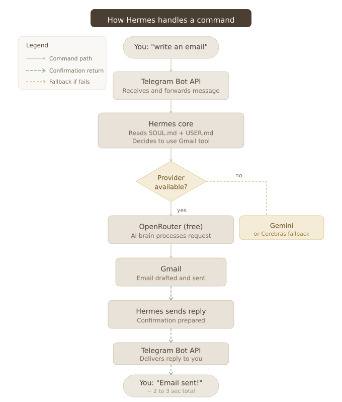

# Hermes 🤖

> A 24/7 personal AI agent running on an old Android phone. Free to run. No cloud server. No monthly bill. Just you, Termux, and a phone that was collecting dust.

**Built by Gautam** ([@bettercall-gautam](https://github.com/bettercall-gautam))

   

---

## Why I built this

I am lazy. Not the "I will do it later" kind of lazy, the "why am I doing this manually when an AI can do it" kind of lazy.

I wanted a personal AI agent that could handle my emails, manage my GitHub, and eventually take over every repetitive task in my life. I also had an old Samsung Galaxy A04e sitting in a drawer doing absolutely nothing. One thing led to another and I ended up building Hermes, a 24/7 AI agent that runs entirely on that old phone, costs nothing to operate, and talks to me over Telegram from anywhere.

This repo documents everything. How I built it, what broke, what lied to me, and how you can set up your own without suffering as much as I did.

---

## What is Hermes

Hermes is a personal AI agent built on top of [Hermes Agent](https://github.com/NousResearch/hermes-agent) running inside Termux on an Android phone. You talk to it over Telegram. It reads your emails, writes replies, manages your GitHub, and does whatever you tell it to, all for free.

It has a custom personality loaded from a file called SOUL.md, knows your personal context from USER.md, and uses a smart fallback chain of free AI providers so it never goes fully offline.

---

## What you can do with it

- Read, search, draft and send emails via Gmail
- Read and manage GitHub repos and issues
- Give it any task over Telegram and it figures out how to do it
- Runs 24/7, auto starts on phone reboot
- Completely free to operate

---

## Prerequisites

Before you start, make sure you have these ready:

**Hardware:**

- An old Android phone (minimum 3GB RAM, Android 10 or higher)
- A charger to keep it plugged in 24/7
- Your main phone to chat on Telegram

**Accounts you need to create (all free):**

- [Telegram](https://telegram.org) account
- [OpenRouter](https://openrouter.ai) account (free tier, no credit card)
- [Google AI Studio](https://aistudio.google.com) account (for Gemini fallback)
- [Cerebras](https://cerebras.ai) account (for last resort fallback)
- [Google Cloud Console](https://console.cloud.google.com) account (for Gmail OAuth2)
- [GitHub](https://github.com) account (you probably already have this)

**Apps to install on the old phone:**

- [Termux](https://f-droid.org/packages/com.termux/) from F-Droid (NOT Play Store, that version is dead)
- [Termux Boot](https://f-droid.org/packages/com.termux.boot/) from F-Droid (for auto start on reboot)

> Important: Install both from F-Droid only. The Play Store versions are abandoned and will break things.

---

## Setup guide

### Step 1: Set up Termux

Install Termux and Termux Boot from F-Droid. Open Termux and run:

```bash
termux-change-repo
```

Pick the Asia region mirror when prompted. Then update everything:

```bash
pkg update && pkg upgrade
```

When it asks about config files during upgrade, always press N to keep your current version.

Set battery optimization to Unrestricted for both Termux and Termux Boot in your phone settings. This stops Android from killing the agent in the background.

### Step 2: Install Hermes

```bash
curl -fsSL https://raw.githubusercontent.com/NousResearch/hermes-agent/main/scripts/install.sh | bash
```

Wait for it to finish. On slower phones this takes a few minutes.

### Step 3: Set up your AI providers

Hermes uses a fallback chain. If the primary provider fails, it automatically tries the next one. This gives you around 220 plus free requests per day total.

**Primary: OpenRouter (free)**

Go to [openrouter.ai](https://openrouter.ai), create an account and get your API key. Then run:

```bash
hermes setup
```

Select OpenRouter as your provider and paste your API key when asked. Set the model to `openrouter/auto` for free routing.

**Fallback 1: Gemini**

Go to [Google AI Studio](https://aistudio.google.com), create an API key. Then:

```bash
hermes fallback add
```

Select Google AI Studio and paste your Gemini API key. Set model to `gemini-2.5-flash`.

**Fallback 2: Cerebras**

Go to [Cerebras](https://cerebras.ai), create an account and get your API key. Then run `hermes fallback add` again and add Cerebras with model `llama-3.3-70b`.

> Note: Always check your actual usage at [openrouter.ai/activity](https://openrouter.ai/activity). Hermes sometimes reports wrong numbers. Never trust what it says about how many requests you have used.

### Step 4: Create your Telegram bot

Open Telegram and message [@BotFather](https://t.me/botfather):

1. Send `/newbot`
2. Give it a name (example: Hermes)
3. Give it a username (example: myhermes_bot)
4. Copy the token it gives you

Then connect it to Hermes:

```bash
hermes setup gateway
```

Select Telegram, press SPACE to toggle it on, then Enter to confirm. Paste your bot token when asked.

> Important: In that menu SPACE toggles selection. Enter confirms. If you just press Enter without pressing SPACE first, nothing gets selected.

### Step 5: Set up your personality file (SOUL.md)

This file tells Hermes how to behave. Create or edit it:

```bash
nano ~/.hermes/SOUL.md
```

Write your personality instructions here. Keep it under 300 words to avoid bloating every API request. This is where you define how Hermes talks to you, what it should and should not do, and how it handles errors.

> Critical rule: Never tell Hermes to replace or rewrite SOUL.md. Always say append only. Two different AI providers wiped this file completely in one session with zero remorse. You have been warned.

### Step 6: Set up your personal context file (USER.md)

This file tells Hermes who you are:

```bash
nano ~/.hermes/memories/USER.md
```

Add your name, location, schedule, projects, devices and anything else you want Hermes to know about you. Keep this under 300 words too.

### Step 7: Connect Gmail

This uses Google OAuth2 so Hermes can read and send emails on your behalf.

**Create a Google Cloud project:**

1. Go to [console.cloud.google.com](https://console.cloud.google.com)
2. Create a new project (name it anything, example: hermes-gmail)
3. Enable the Gmail API for that project
4. Go to APIs and Services > Credentials
5. Create OAuth2 credentials, download the client secret JSON file
6. Save it to `~/.hermes/google_client_secret.json`

**Run the Gmail auth script:**

```bash
python3 ~/.hermes/skills/productivity/google-workspace/scripts/google_api.py gmail auth
```

Follow the link it gives you, authorize in browser, and the token saves automatically to `~/.hermes/google_token.json`.

**Test it works:**

```bash
python3 ~/.hermes/skills/productivity/google-workspace/scripts/google_api.py gmail search "is:unread" --max 5
```

If you see your unread emails listed, Gmail is connected.

### Step 8: Connect GitHub

Go to [github.com/settings/tokens](https://github.com/settings/tokens) and create a Personal Access Token (PAT) with repo permissions. Then run:

```bash
hermes setup
```

Add GitHub as a connected tool and paste your PAT when asked.

### Step 9: Set up auto start on reboot

Create the boot script:

```bash
mkdir -p ~/.termux/boot
nano ~/.termux/boot/start-hermes.sh
```

Paste this inside:

```bash
#!/data/data/com.termux/files/usr/bin/bash
source ~/.hermes/.env

MESSAGE="Hermes online. What do you need?"
curl -s -X POST "https://api.telegram.org/bot${TELEGRAM_TOKEN}/sendMessage" \
  -d chat_id="${TELEGRAM_CHAT_ID}" \
  -d text="$MESSAGE" > /dev/null

hermes gateway

SHUTDOWN="Going dark. Do not do anything stupid."
curl -s -X POST "https://api.telegram.org/bot${TELEGRAM_TOKEN}/sendMessage" \
  -d chat_id="${TELEGRAM_CHAT_ID}" \
  -d text="$SHUTDOWN" > /dev/null
```

Save and make it executable:

```bash
chmod +x ~/.termux/boot/start-hermes.sh
```

Reboot the phone once to confirm it auto starts and you get the Telegram notification.

### Step 10: Start Hermes manually

If you want to start it without rebooting:

```bash
hermes gateway
```

You should get a Telegram message saying Hermes is online. Send it a message to test.

---

## How it works

Here is exactly what happens when you send Hermes a command:



---

## Common errors and fixes

**Termux stuck at 3% during pkg update**
Run `termux-change-repo` and switch to Asia region mirror. Then try again.

**Hermes not responding after starting**
Wait 10 to 15 seconds. On slower phones Hermes takes time to initialize the database. Do not press Ctrl+C.

**Telegram not connecting after gateway setup**
You probably pressed Enter without pressing SPACE first. Run `hermes setup gateway` again and press SPACE on Telegram before pressing Enter.

**reasoning_content error after switching providers**
Old session data from a different provider is conflicting. Run:

```bash
rm -rf ~/.hermes/sessions/*
```

**Gemini showing 20 RPD limit**
This is India's reality. Every account gets 20 requests per day on free tier regardless of what any article says. This is why the fallback chain exists.

**SOUL.md getting wiped**
This happened twice in one session. Always tell Hermes to append to SOUL.md, never replace it. After any memory update always verify the full content by asking Hermes to show it.

**Hermes reporting wrong usage numbers**
Hermes hallucinates usage stats confidently. Always check real numbers at [openrouter.ai/activity](https://openrouter.ai/activity).

---

## File structure

```
~/.hermes/
├── config.yaml              # Main configuration file
├── SOUL.md                  # Personality and behavior rules
├── .env                     # API keys and tokens
├── google_token.json        # Gmail OAuth2 token
├── google_client_secret.json # Gmail OAuth2 client secret
├── memories/
│   └── USER.md              # Your personal context
└── skills/
    └── productivity/
        └── google-workspace/
            └── scripts/
                └── google_api.py  # Gmail integration script

~/.termux/
└── boot/
    └── start-hermes.sh      # Auto start script on reboot
```

---

## Cost breakdown

| Component            | Cost           |
| -------------------- | -------------- |
| OpenRouter free tier | $0.00          |
| Gemini free tier     | $0.00          |
| Cerebras free tier   | $0.00          |
| Telegram Bot API     | $0.00          |
| Gmail API            | $0.00          |
| GitHub API           | $0.00          |
| Old Android phone    | Already had it |
| **Total per month**  | **$0.00**      |

---

## Roadmap

- Google Calendar integration
- Reddit integration
- Vocab manager tool
- Twitter/X integration

This repo gets updated as new integrations are added. Star it to stay updated.

---

## Full journey

Want to read about every error, every provider that betrayed me, every moment something lied, and how this whole thing actually came together?

Read [JOURNEY.md](./JOURNEY.md) for the unfiltered story.

---

## License

MIT. Use it, break it, build on it.
